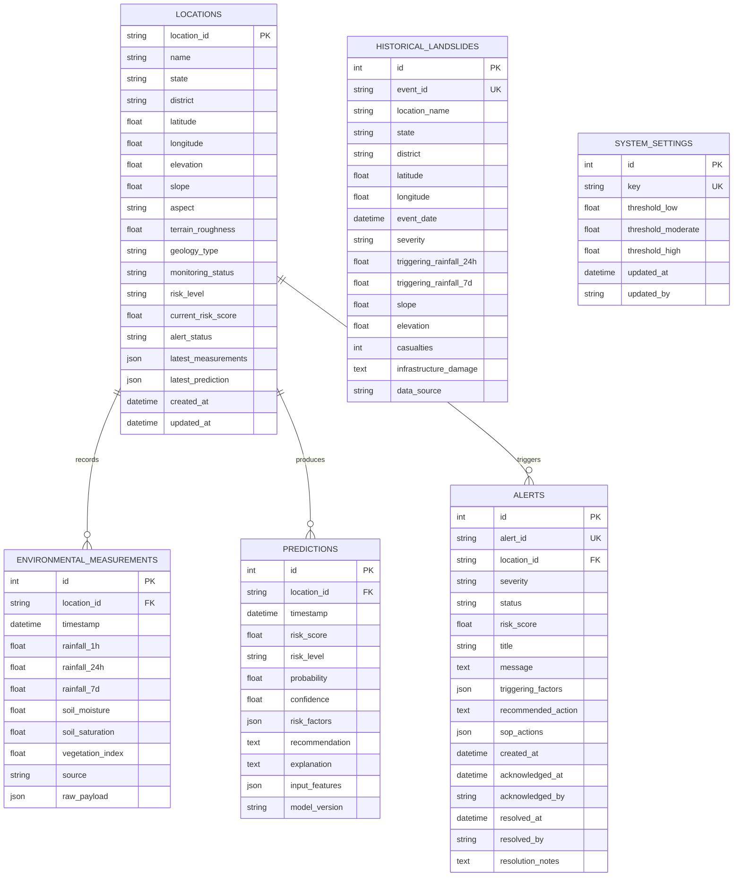

# Database Specification: AI-Based early warning and landslide Risk Monitoring System in NER

## 1. Overview & Dual Database Architecture

The persistence layer uses **SQLAlchemy 2.0 ORM** supporting both:
- **SQLite (Zero-Config Development):** Out-of-the-box local development and automated CI testing.
- **PostgreSQL 16 (Production / Cloud):** High-concurrency ACID transactions, connection pooling, and JSON storage for Docker and Render.

---

## 2. Entity-Relationship Schema

---

## 3. Pre-Seeded Datasets

Upon first startup, the system automatically checks if tables are empty and executes `app.database.seed_data.seed_database()`:
- **16 High-Risk North Eastern Sites:** Representing all 8 states (Guwahati, Haflong, Cherrapunji, Shillong, Aizawl, Champhai, Kohima, Mokokchung, Tupul Noney, Imphal, Itanagar, Tawang, Gangtok, Mangan, Dharmanagar, Belonia).
- **8 Major GSI Historical Disasters:** Complete with casualty figures, triggering rainfall, and geological fault line data.
- **Default Operational Hazard Boundaries:** LOW < 25, MODERATE 25–50, HIGH 50–75, SEVERE > 75.
